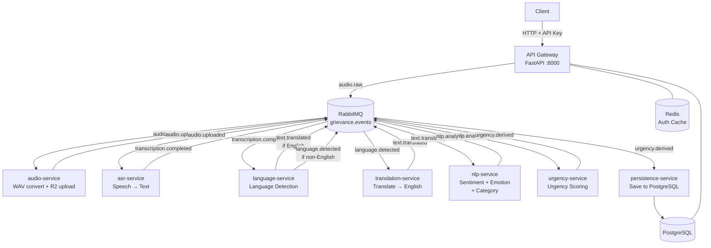

# Grievance AI System

An event-driven, microservices-based AI system that processes audio grievances end-to-end — from raw audio upload through speech recognition, language detection, translation, NLP analysis, urgency scoring, and final persistence to a PostgreSQL database.

---

## Table of Contents

1. [How It Works](#how-it-works)
2. [Architecture](#architecture)
3. [Services](#services)
4. [Message Pipeline](#message-pipeline)
5. [Database Schema](#database-schema)
6. [Prerequisites](#prerequisites)
7. [Quick Start](#quick-start)
8. [Running the System](#running-the-system)
9. [API Reference](#api-reference)
10. [Authentication](#authentication)
11. [Monitoring & Logs](#monitoring--logs)
12. [Project Structure](#project-structure)

---

## How It Works

A user (or an application) uploads an audio recording of a grievance. The system automatically:

1. Converts the audio to WAV and stores it in Cloudflare R2 object storage.
2. Transcribes the speech using an omnilingual ASR model.
3. Detects the language of the transcript.
4. Translates non-English transcripts to English.
5. Runs NLP analysis — extracts **sentiment**, **emotion**, **category**, and **keywords**.
6. Derives an **urgency level** from the NLP output.
7. Persists the fully-enriched grievance record to PostgreSQL.

Each step is handled by a dedicated worker service that reads from RabbitMQ, does its work, and publishes an event for the next stage. The stages are fully decoupled — any service can be scaled independently.

---

## Architecture



**Infrastructure components:**

| Component | Purpose | Default port |
|---|---|---|
| RabbitMQ | Message broker (topic exchange `grievance.events`) | 5672 (AMQP), 15672 (management UI) |
| PostgreSQL | Persistent storage for grievances, apps, API keys | 5433 (host-mapped) |
| Redis | Auth token/API key cache | 6379 |
| Cloudflare R2 | Object storage for uploaded & converted audio | — |

---

## Services

| Service | Role | Consumes | Publishes |
|---|---|---|---|
| **api-gateway** | HTTP entry point; auth; publishes raw audio events | — | `audio.raw` |
| **audio-service** | Converts audio to WAV; uploads to R2 | `audio.raw` | `audio.uploaded` |
| **asr-service** | Automatic speech recognition (omnilingual) | `audio.uploaded` | `transcription.completed` |
| **language-service** | Detects transcript language; branches pipeline | `transcription.completed` | `text.translated` or `language.detected` |
| **translation-service** | Translates non-English text to English via OpenAI/Ollama | `language.detected` | `text.translated` |
| **nlp-service** | Sentiment, emotion, grievance category classification (HuggingFace) | `text.translated` | `nlp.analyzed` |
| **urgency-service** | Maps emotion + sentiment + category to urgency level | `nlp.analyzed` | `urgency.derived` |
| **persistence-service** | Writes enriched grievance record to PostgreSQL | `urgency.derived` | — |
| **analytics-service** | Read-only query/aggregation layer | — | — |
| **auth_service** | JWT issuance and API key management (shared library) | — | — |

---

## Message Pipeline

The pipeline uses a single RabbitMQ **topic exchange** (`grievance.events`). Each worker binds a durable queue to its routing key.

```
audio.raw
  └─► audio-service
        └─► audio.uploaded
              └─► asr-service
                    └─► transcription.completed
                          └─► language-service
                                ├─► text.translated  (English path — skips translation)
                                └─► language.detected
                                      └─► translation-service
                                            └─► text.translated
                                                  └─► nlp-service
                                                        └─► nlp.analyzed
                                                              └─► urgency-service
                                                                    └─► urgency.derived
                                                                          └─► persistence-service
```

Every message carries a `request_id` (the `audio.id` UUID) so the API gateway can return status and results by polling `GET /audio/{id}`.

---

## Database Schema

```
apps              — registered client applications (email, password)
api_keys          — encrypted API keys tied to an app
audios            — one record per upload; tracks status + current pipeline stage
categories        — per-app custom grievance categories (JSON)
grievances        — final enriched record: transcript, language, sentiment,
                    emotion, category, urgency, keywords, recommended_action
```

Migrations are managed by **Alembic** (`migrations/versions/`).

---

## Prerequisites

| Tool | Version | Purpose |
|---|---|---|
| Python | ≥ 3.11 | Runtime |
| [uv](https://docs.astral.sh/uv/) | latest | Dependency management & venv |
| Docker + Docker Compose | any recent | Infrastructure (RabbitMQ, Postgres, Redis) |
| ffmpeg | any | Audio conversion (used by audio-service) |
| openssl | any | API key generation script |
| psql | any | `generate_api_key.sh` script |

> **ML model weights** are large (~GB). The ASR models are downloaded to `services/asr-service/model_cache/` on first run. HuggingFace NLP models download to `uploads/model_cache/` automatically.

---

## Quick Start

```bash
# 1. Clone
git clone <repo-url>
cd grievance-ai-system

# 2. Configure
cp .env.example .env
# Edit .env — see the .env.example comments for what each variable does

# Once everything is clean, then run the fresh download:
cd grievance-ai-system/services/asr-service

mkdir -p model_cache/short_asr/60787894e1cd3958ab8ac97c

curl -L --progress-bar \
  -o model_cache/short_asr/60787894e1cd3958ab8ac97c/omniASR-LLM-1B-v2.pt \
  https://dl.fbaipublicfiles.com/mms/omniASR-LLM-1B-v2.pt

  
# 3. Start infrastructure
docker-compose up -d

# 4. Install Python dependencies
uv sync
source .venv/bin/activate

# 5. Run database migrations
alembic upgrade head

# 6. Start everything (API gateway + all workers)
python main.py
```

The API is available at **http://localhost:8000**. Interactive docs at **http://localhost:8000/docs**.

---

## Running the System

### Option A — Single command (recommended)

```bash
python main.py
```

`main.py` starts all seven pipeline workers as background subprocesses (with PID-file deduplication — already-running workers are skipped) and then starts the API gateway with uvicorn in the foreground. Logs for each worker go to `logs/<service>.log`.

```
logs/
  audio-service.log
  asr-service.log
  language-service.log
  translation-service.log
  nlp-service.log
  urgency-service.log
  persistence-service.log
```

Press `Ctrl+C` to stop the gateway; workers are terminated automatically via `atexit`.

### Option B — Workers only (shell script)

```bash
bash scripts/run_workers.sh
```

Workers run in the background (via `nohup`). They are **not** stopped when the script exits — kill them manually:

```bash
pkill -f "app.main"
```

### Option C — API gateway only

Useful when workers are already running from a previous session (PID files will prevent duplicates in Option A):

```bash
uvicorn app.main:app --app-dir services/api-gateway --host 0.0.0.0 --port 8000
```

### Monitoring logs

```bash
# All workers at once
tail -f logs/*.log

# Single service
tail -f logs/nlp-service.log
```

### RabbitMQ management UI

Open http://localhost:15672 (user: `sentiment`, password: `password`) to inspect queues, message rates, and bindings.

---

## API Reference

Interactive Swagger UI: **http://localhost:8000/docs**

### Health

```
GET /health
```

### Auth

| Method | Path | Description |
|---|---|---|
| `POST` | `/auth/register` | Register a new application account |
| `POST` | `/auth/login` | Login and receive a JWT |
| `POST` | `/auth/api-key` | Create an API key (requires JWT `Bearer` token) |
| `DELETE` | `/auth/api-key` | Revoke the active API key |

### Audio

All audio endpoints require the `X-API-Key` header.

| Method | Path | Description |
|---|---|---|
| `POST` | `/audio/upload` | Upload an audio file; triggers the full pipeline |
| `GET` | `/audio/{id}` | Poll processing status and results for a submission |
| `GET` | `/audio` | List all submissions for the authenticated app |

### Categories

| Method | Path | Description |
|---|---|---|
| `POST` | `/category` | Create or update grievance categories for your app |
| `GET` | `/category` | Retrieve categories for your app |

---

## Authentication

The system uses a two-step auth model:

**Step 1 — Register and log in**

```bash
# Register
curl -X POST http://localhost:8000/auth/register \
  -H "Content-Type: application/json" \
  -d '{"name": "My App", "email": "me@example.com", "password": "secret"}'

# Login → receive JWT
curl -X POST http://localhost:8000/auth/login \
  -H "Content-Type: application/json" \
  -d '{"email": "me@example.com", "password": "secret"}'
```

**Step 2 — Create an API key**

```bash
curl -X POST http://localhost:8000/auth/api-key \
  -H "Authorization: Bearer <jwt_token>"
# Returns: { "api_key": "abc123..." }
```

**Step 3 — Use the API key for all requests**

```bash
curl -X POST http://localhost:8000/audio/upload \
  -H "X-API-Key: <api_key>" \
  -F "file=@/path/to/recording.mp3"
```

### Admin — generate an API key directly via script

For admin/service accounts that bypass the registration flow:

```bash
# Usage: ./scripts/generate_api_key.sh <identifier> [expires_days]
bash scripts/generate_api_key.sh "admin-key" 365
```

The script generates a random key, hashes it, inserts it into the database, and prints the raw key once — store it securely.

---

## Monitoring & Logs

- **Worker logs:** `logs/<service>.log` — each worker writes structured JSON logs.
- **RabbitMQ UI:** http://localhost:15672 — queue depths, delivery rates, bindings.
- **PID files:** `logs/<service>.pid` — used by `main.py` to avoid restarting live workers.
- **Database:** Query the `audios` table for pipeline progress (`status`, `current_stage`).

```sql
-- Check in-progress and failed records
SELECT id, status, current_stage, created_at
FROM audios
WHERE status != 'completed'
ORDER BY created_at DESC;
```

---

## Project Structure

```
grievance-ai-system/
├── main.py                    # Starts all workers + API gateway
├── config.py                  # Root Pydantic settings (DATABASE_URL, REDIS_URL)
├── pyproject.toml             # Dependencies (managed by uv)
├── docker-compose.yml         # RabbitMQ, PostgreSQL, Redis
├── alembic.ini                # Alembic config (points to migrations/)
├── .env.example               # Environment variable template
│
├── migrations/                # Alembic migration scripts
│   └── versions/
│
├── services/
│   ├── api-gateway/app/       # FastAPI app, routes, schemas, middleware
│   ├── audio-service/app/     # WAV conversion, R2 upload
│   ├── asr-service/app/       # ASR transcription, model loader
│   ├── language-service/app/  # Language detection
│   ├── translation-service/app/ # OpenAI / Ollama translation
│   ├── nlp-service/app/       # Sentiment, emotion, category models
│   ├── urgency-service/app/   # Urgency derivation logic
│   ├── persistence-service/app/ # PostgreSQL writer
│   ├── analytics-service/     # Query / reporting service
│   └── auth_service/app/      # JWT + API key library (shared)
│
├── shared/
│   ├── common/messaging/      # aio-pika publisher / consumer helpers
│   ├── constants/             # Routing keys, queue names, status codes
│   ├── database/
│   │   ├── models/            # SQLAlchemy ORM models
│   │   ├── services/          # DB CRUD helpers
│   │   └── session.py         # Async session factory
│   ├── schemas/               # Pydantic request/response schemas
│   └── utils/                 # Logger, ID generator, tracing helpers
│
├── scripts/
│   ├── generate_api_key.sh    # Admin API key provisioning
│   ├── run_workers.sh         # Shell-based worker launcher
│   └── run_api_with_workers.sh
│
├── docs/
│   ├── architecture.md        # Architecture decision records
│   └── api-key-auth.md        # API key design notes
│
└── logs/                      # Runtime worker logs + PID files (git-ignored)
```
- `persistence-service` prints the final payload to its log as the terminal stage.

For the current test payload, the final result is an English path with a neutral NLP result and `low` urgency.

## Example Logs

After a successful run, you should see output like this:

```text
audio-service.log        Processed audio -> uploads/<file>.wav
asr-service.log          Transcribed: Transcription of uploads/<file>.wav
language-service.log     English detected -> skipping translation
nlp-service.log          NLP done -> {'sentiment': 'neutral', 'emotion': 'calm', 'category': 'general'}
urgency-service.log      urgency: low
persistence-service.log  persisted: test-001
```

## Stop The Pipeline

Stop the worker processes:

```bash
pkill -f 'app.main'
```

Stop infrastructure:

```bash
docker-compose down
```

## Production

- Use `deployments/k8s/` for Kubernetes
- See `docs/` for architecture and scaling

## API Key Authentication

- See `docs/api-key-auth.md` for full design and integration details
- Generate keys: `./scripts/generate_api_key.sh <identifier> [expires_days]`
- Protect FastAPI routes: add `Depends(verify_api_key)`
- The API gateway also enforces API key checks in middleware for protected routes

---

## Running the API Gateway

The API Gateway is a FastAPI app located at `services/api-gateway/`.

### Prerequisites

Make sure you have a virtual environment with dependencies installed (see **Local Setup** above). The gateway only needs `fastapi`, `uvicorn`, and `python-multipart`:

```bash
uv pip install --python .venv/bin/python fastapi uvicorn python-multipart
```

### Start the server

**Option A — from the repo root** (recommended, no `cd` needed):

```bash
source .venv/bin/activate
PYTHONPATH=services/api-gateway:. uvicorn app.main:app --app-dir services/api-gateway --reload --port 8000
```

This repo-root command needs both import roots:

- `services/api-gateway` so `app.main` resolves
- `.` so shared modules like `shared.database.models` and `services.auth_service` resolve

Without the extra `PYTHONPATH`, `uvicorn --app-dir` adds only `services/api-gateway` to Python's import path, which causes `ModuleNotFoundError: No module named 'shared'`.

**Option B — from inside the service directory**:

```bash
source .venv/bin/activate
cd services/api-gateway
PYTHONPATH=../.. uvicorn app.main:app --reload --port 8000
```

**Option C — use the repo launcher**:

```bash
source .venv/bin/activate
.venv/bin/python main.py
```

**Option C — start workers + API together** (single command):

```bash
source .venv/bin/activate
bash scripts/run_api_with_workers.sh
```

This starts all worker consumers (`audio-service`, `asr-service`, `language-service`, `translation-service`, `nlp-service`, `urgency-service`, `persistence-service`) and then runs the API Gateway.

> **Stop behavior:** `Ctrl+C` stops only FastAPI. Workers are background processes; stop them with:
>
> ```bash
> pkill -f 'app.main'
> ```

> **Note:** Do not use `services.api_gateway.app.main` — the directory name contains a hyphen which Python cannot import as a module. Use one of the startup options above.

The server will be available at **http://localhost:8000**.

### Interactive API docs

| URL                                | Description                              |
| ---------------------------------- | ---------------------------------------- |
| http://localhost:8000/docs         | Swagger UI (try endpoints interactively) |
| http://localhost:8000/redoc        | ReDoc documentation                      |
| http://localhost:8000/openapi.json | Raw OpenAPI schema                       |

### Available endpoints

| Method   | Path                | Description                         |
| -------- | ------------------- | ----------------------------------- |
| `POST`   | `/auth/register`    | Register a new application          |
| `POST`   | `/auth/login`       | Login and receive a JWT token       |
| `POST`   | `/auth/api-key`     | Generate an API key from a JWT      |
| `DELETE` | `/auth/api-key`     | Revoke the active API key           |
| `GET`    | `/auth/verify`      | Verify an API key                   |
| `POST`   | `/audio`            | Upload an audio file for processing |
| `GET`    | `/audio/{audio_id}` | Poll processing status and results  |
| `GET`    | `/health`           | Health check                        |

### Auth rules

- Public routes: `/health`, `/docs`, `/openapi.json`, `/redoc`, `/auth/register`, `/auth/login`
- JWT bearer token routes: `POST /auth/api-key`, `DELETE /auth/api-key`
- API key routes: `GET /auth/verify`, `POST /audio`, `GET /audio/{audio_id}`
- Protected requests are enforced at the API gateway middleware layer, and the audio routes also declare API key security in OpenAPI so Swagger shows lock icons

### Quick smoke test with curl

```bash
# Register an app
curl -s -X POST http://localhost:8000/auth/register \
  -H "Content-Type: application/json" \
  -d '{"name":"my_app","email":"test@example.com"}'

# Login and capture JWT
LOGIN_RESPONSE=$(curl -s -X POST http://localhost:8000/auth/login \
  -H "Content-Type: application/json" \
   -d '{"email":"test@example.com"}')

JWT_TOKEN=$(printf '%s' "$LOGIN_RESPONSE" | sed -n 's/.*"access_token":"\([^"]*\)".*/\1/p')

# Generate an API key from the JWT
API_KEY_RESPONSE=$(curl -s -X POST http://localhost:8000/auth/api-key \
   -H "Authorization: Bearer $JWT_TOKEN")

API_KEY=$(printf '%s' "$API_KEY_RESPONSE" | sed -n 's/.*"api_key":"\([^"]*\)".*/\1/p')

# Verify the API key
curl -s http://localhost:8000/auth/verify \
   -H "X-API-Key: $API_KEY"

# Upload audio with the API key
curl -s -X POST http://localhost:8000/audio \
   -H "X-API-Key: $API_KEY" \
  -F "file=@/path/to/audio.wav"

# Poll status
curl -s http://localhost:8000/audio/<audio_id> \
   -H "X-API-Key: $API_KEY"

# Revoke the API key
curl -s -X DELETE http://localhost:8000/auth/api-key \
   -H "Authorization: Bearer $JWT_TOKEN"
```

Auth flow summary:

- Use `/auth/register` to create an app record.
- Use `/auth/login` to get a JWT bearer token.
- Use that JWT only for `/auth/api-key` create and revoke operations.
- Use the API key in `X-API-Key` for protected routes such as `/audio` and `/auth/verify`.
